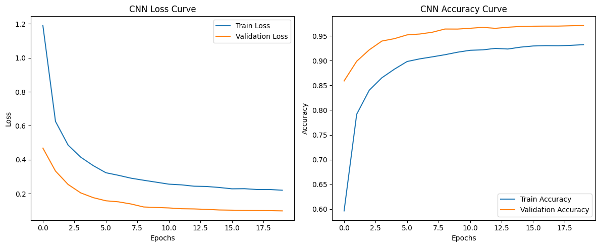
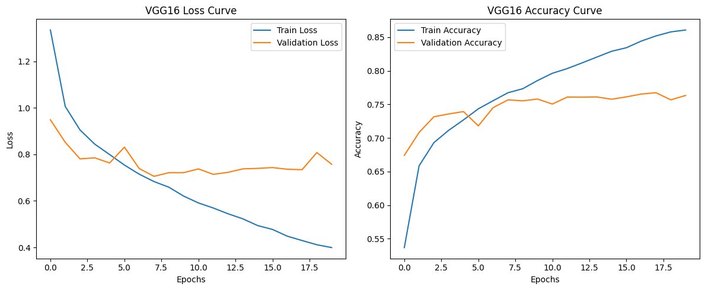
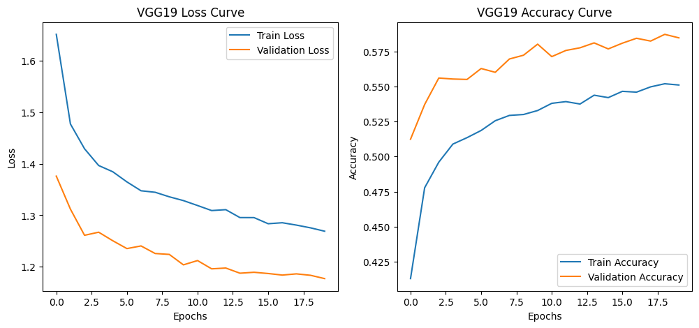

# HW5=Deep Learning basics  

## HW5-1: iris classification problem (tf.keras)  
  
## HW5-1: iris classification problem (pytorch)  
  
## HW5-1: iris classification problem (pytorch lightning)  
  

## HW5-2: 手寫辨認(DNN/tf.keras)  
```python
Epoch 1/20
1875/1875 ━━━━━━━━━━━━━━━━━━━━ 11s 3ms/step - accuracy: 0.7721 - loss: 0.6996 - val_accuracy: 0.9389 - val_loss: 0.1984
Epoch 2/20
1875/1875 ━━━━━━━━━━━━━━━━━━━━ 9s 3ms/step - accuracy: 0.9166 - loss: 0.2707 - val_accuracy: 0.9488 - val_loss: 0.1591
...
Epoch 20/20
1875/1875 ━━━━━━━━━━━━━━━━━━━━ 10s 4ms/step - accuracy: 0.9688 - loss: 0.1024 - val_accuracy: 0.9739 - val_loss: 0.0866
313/313 ━━━━━━━━━━━━━━━━━━━━ 0s 2ms/step - accuracy: 0.9698 - loss: 0.1017

Test accuracy: 0.9739
```
  

## HW5-2: 手寫辨認(CNN/tf.keras) 
```python
Epoch 1/20
1875/1875 ━━━━━━━━━━━━━━━━━━━━ 17s 7ms/step - accuracy: 0.8276 - loss: 0.5258 - val_accuracy: 0.9737 - val_loss: 0.0863
Epoch 2/20
1875/1875 ━━━━━━━━━━━━━━━━━━━━ 16s 7ms/step - accuracy: 0.9639 - loss: 0.1179 - val_accuracy: 0.9808 - val_loss: 0.0573
...
Epoch 20/20
1875/1875 ━━━━━━━━━━━━━━━━━━━━ 16s 7ms/step - accuracy: 0.9935 - loss: 0.0192 - val_accuracy: 0.9867 - val_loss: 0.0515
313/313 ━━━━━━━━━━━━━━━━━━━━ 1s 3ms/step - accuracy: 0.9821 - loss: 0.0693  

Test accuracy: 0.9867
```
  

## HW5-2: 手寫辨認(DNN/pytorch) 
```python
Using device: cuda
NVIDIA GeForce GTX 1060 3GB
Memory Usage:
Allocated: 0.0 MB
Cached: 0.0 MB
```

```python
Epoch 1/20, Train Loss: 0.6248, Train Acc: 0.8028, Val Loss: 0.2488, Val Acc: 0.9259
Epoch 2/20, Train Loss: 0.4018, Train Acc: 0.8787, Val Loss: 0.1922, Val Acc: 0.9404
...
Epoch 20/20, Train Loss: 0.2427, Train Acc: 0.9285, Val Loss: 0.1210, Val Acc: 0.9651
```
  

## HW5-2: 手寫辨認(CNN/pytorch) 
```python
Epoch 1/20, Train Loss: 1.1901, Train Acc: 0.5965, Val Loss: 0.4684, Val Acc: 0.8589
Epoch 2/20, Train Loss: 0.6256, Train Acc: 0.7916, Val Loss: 0.3331, Val Acc: 0.8986
...
Epoch 20/20, Train Loss: 0.2203, Train Acc: 0.9321, Val Loss: 0.0986, Val Acc: 0.9707
```
  

## HW5-3: Cifar 圖片分類 VGG16 pretrained  
```python
Test accuracy: 0.7603
```
  
## HW5-3: Cifar 圖片分類 VGG19 pretrained  
```python
Test accuracy: 0.5804
```
